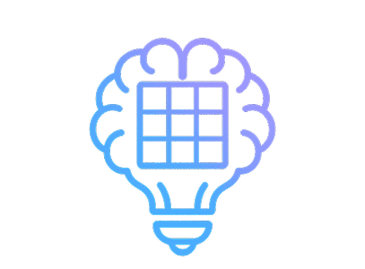

  

<h1 align="center">SudoLogic</h1>

## Project Overview
**SudoLogic** is a mobile-first online platform where users can play Sudoku puzzles of varying difficulties - including *Easy*, *Medium*, *Hard*, and *Expert* levels. Designed for accessibility and engagemnet, the platform offer both a classic experience and a *Daily Puzzle* mode that refreshes every 24 hours, encouraging users to return regularly and build a daily streak.

The app is aimed at a wide audience, including casual gamers, puzzle enthusiasts, and learners seekig to improve their logical thinking skills. The intuitive mobile-first layout ensures a seamless experience across all devices, while smart gameplay features such as error checking, hint mode, and daily progress tracking elevate it beyond basic web sudoku clones.

### Site Preview
_A full preview of the final design will be added here once development is complete._

_This section will include:_

_Screenshots of the live site on mobile, tablet, and desktop_

_A responsive mockup image showing the site across multiple devices

Visit the website: [SudoLogic]()

## Table fo Contents
- [Project Overview](#project-overview)
  - [Site Preview](#site-preview)
- [Project Goals](#project-goals)
  - [Business Goals](#business-goals)
  - [Call to Action (CTA)](#call-to-action-cta)
- [User Experience (UX)](#user-experience-ux)
  - [User Goals](#user-goals)
  - [User Stories](#)
  - [Site Owner Goals](#)
  - [Design Requirements](#)
- [Design Process](#)
  - [Wireframes](#)
  - [Colour Scheme](#)
  - [Typography](#)
  - [Imagery](#)
- [Features](#)
  - [Existing Features](#)
  - [Future Enhancements](#)
- [Technologies Used](#)
- [Testing](#)
- [Deployment](#)
- [Credits](#)
- [Acknowledgements](#)

## Project Goals
The goal of **SudoLogic** is to provide a clean, distraction-free online platform where users of all ages can enjoy solving Sudoku puzzles. The site follows a mobile-first design philosophy to ensure maximum accessibility and ease of use across all devices.

### Business Goals
- Offer a free, high-quality Sudoku experience to attract and retain users.
- Encourage daily engagement through a new daily puzzles and user streak tracking.
- Establish the project as a portfolio-worthy demonstration of frontend development, responsive design, and user-centered thinking.

### Call to Action (CTA)
The primary call to action is" 
**"Play Today's Puzzle"** - prominently displayed on the homepage to encourage immmediate interaction with the latest Sudoku game.

Secondary CTAs include:
- **"Choose a Difficulty"** - allowing users to play puzzles at their preferred level (Easy, Medium, Hard, Expert).
- **"Track You Streak"** - encouraging repeat visitis through progress tracking (planned future feature).

## User Experience (UX)
SudoLogic was designed with a user-centred approach to ensure an engaging, accessible, and intuitive Sudoku experience. By following Jesse Jame Garrett's Five Planes of UX - **Strategy, Scope, Structure, Skeleton, and Surface** i the design and functionality of the site were carefully planned and executed to meet both the user and the business goals.

### User Goals
At the Strategy Plane, I focused on identifying and prioritising the core needs of our target users to ensure the app delivers a purposeful and engaging experience. These key goals include:
- Pay Sudoku easily on any device.
- Choose between a Daily Challenge or a new Random Puzzle.
- Access clear instructions both before and during gameplay.
- Use intuitive controls to input, erase, or pencil in numbers.
- Recieve optional feedback on mistakes or check answers manually.
- Track daily puzzle streaks and time-based performance.
- Save game progress automatically and resume later.
- Share results and celebrate completion with animations.
- Enjoy a fun and frustration-free experience with accessibility features.