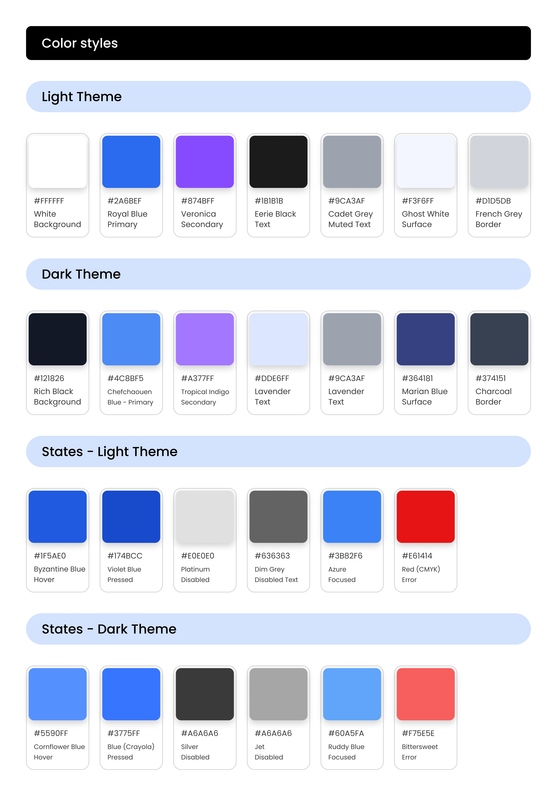

# SudoLogic

## Project Overview
**SudoLogic** is a mobile-first online platform where users can play Sudoku puzzles of varying difficulties - including *Easy*, *Medium*, *Hard*, and *Expert* levels. Designed for accessibility and engagement, the platform offer both a classic experience and a *Daily Puzzle* mode that refreshes every 24 hours, encouraging users to return regularly and build a daily streak.

The app is aimed at a wide audience, including casual gamers, puzzle enthusiasts, and learners seeking to improve their logical thinking skills. The intuitive mobile-first layout ensures a seamless experience across all devices, while smart gameplay features such as error checking, hint mode, and daily progress tracking elevate it beyond basic web sudoku clones.

### Site Preview
_A full preview of the final design will be added here once development is complete._

_This section will include:_

_Screenshots of the live site on mobile, tablet, and desktop_

_A responsive mockup image showing the site across multiple devices

Visit the website: [SudoLogic]()

## Table fo Contents
- [Project Overview](#project-overview)
  - [Site Preview](#site-preview)
- [Project Goals](#project-goals)
  - [Business Goals](#business-goals)
  - [Call to Action (CTA)](#call-to-action-cta)
- [User Experience (UX)](#user-experience-ux)
  - [User Goals](#user-goals)
  - [User Stories](#user-stories)
  - [User Journey Overview](#user-journey-overview)
  - [Site Owner Goals](#site-owner-goals)
  - [Design Requirements](#design-requirements)
- [Design Process](#)
  - [Wireframes](#)
  - [Colour Scheme](#)
  - [Typography](#)
  - [Imagery](#)
- [Features](#)
  - [Existing Features](#)
  - [Future Enhancements](#)
- [Technologies Used](#)
- [Testing](#)
- [Deployment](#)
- [Credits](#)
- [Acknowledgements](#)

## Project Goals
The goal of **SudoLogic** is to provide a clean, distraction-free online platform where users of all ages can enjoy solving Sudoku puzzles. The site follows a mobile-first design philosophy to ensure maximum accessibility and ease of use across all devices.

### Business Goals
- Offer a free, high-quality Sudoku experience to attract and retain users.
- Encourage daily engagement through new daily puzzles and user streak tracking.
- Establish the project as a portfolio-worthy demonstration of frontend development, responsive design, and user-centred thinking.

### Call to Action (CTA)
The primary call to action is **"Play Today's Puzzle"** - prominently displayed on the homepage to encourage immediate interaction with the latest Sudoku game.

Secondary CTAs include:
- **"Choose a Difficulty"** - allowing users to play puzzles at their preferred level (Easy, Medium, Hard, Expert).
- **"Track Your Streak"** - visually reinforces player consistency through a celebratory modal at game game start.

[Back to top](#sudologic)

## User Experience (UX)
SudoLogic was designed with a user-centred approach to ensure an engaging, accessible, and intuitive Sudoku experience. By following Jesse Jame Garrett's Five Planes of UX - **Strategy, Scope, Structure, Skeleton, and Surface** the design and functionality of the site were carefully planned and executed to meet both the user and the business goals.

### User Goals
At the Strategy Plane, I focused on identifying and prioritising the core needs of our target users to ensure the app delivers a purposeful and engaging experience. These key goals include:
- Pay Sudoku easily on any device.
- Choose between a Daily Challenge or a new Random Puzzle.
- Access clear instructions both before and during gameplay.
- Use intuitive controls to input, erase, or pencil in numbers.
- Receive optional feedback on mistakes or check answers manually.
- Track daily puzzle streaks and time-based performance.
- Save game progress automatically and resume later.
- Share results and celebrate completion with animations.
- Enjoy a fun and frustration-free experience with accessibility features.

### User Stories
User stories are fully detailed on the [GitHub Project Board](https://github.com/users/creatvie-introvert/projects/11/views/1), and have been written using a user-centred desgn approach aligned with the UX Strategy and Scope Planes.

**New and First-Time Users**
- As a new user, I want to choose between a Daily Puzzle and a Random Puzzle so I can get started quickly.
- As a user, I want to view clear instructions before or during the game so I can learn how to play.
- As a user, I want to select a difficulty level when starting a new puzzle so I can play at my preferred challenge level.
- As a user, I want the interface to be intuitive and responsive so I can play comfortably on any device.

**During Gameplay**
- As a user, I want to input numbers and use pencil marks so I can keep track of possible solutions.
- As a user, I want to toggle pencil mode so I can switch between notes and final answers.
- As a user, I want to undo, redo, or reset the puzzle so I can fix mistakes or start fresh.
- As a user, I want to request a hint so I can get help if I'm stuck.
- As a user, I want to toggle error highlighting so I can choose whether or not to see mistakes as I go.
- As a user, I want to check my answers manually so I can verify them, if error highlighting is turned off.
- As a user, I want to clear a single cell so I can update my inputs precisely.
- As a user, I want a timer to track how long I've been playing so I can measure my performance.
- As a user, I want the timer to pause if I leave the page or view the instructions so my time stays accurate.
- As a user, I want to access instructions during gameplay so I can get help if I forget something.

**After Gameplay**
- As a user, I want to see a celebration animation when I complete a puzzle so I feel rewarded.
- As a user, I want to view my score or stats after completing a puzzle so I can asses my performance.
- As a user, I want to share my results so I can celebrate or compete with friends.

**Returning Users and Long-Term Use**
- As a user, I want the game to autosave so I can return to it later without losing progress.
- As a user, I want to track my daily streak so I stay motivated to play regularly.
- As a user, I want a setting panel so I can control features like sound, contrast, or input modes.
- As a user, I want the interface to include accessibility options so I can play regardless of my needs.
- As a user, I want to recieve confirmation before resetting or starting a new game so I don't accidentally lose my progress.
- As a user, I want to contact support or provide feedback so I can get help or suggest improvements.

### User Journey Overview
At the Structure Plane, I planned clear and purposeful flow from start to finish, shaped around engagement, simplicity, and flow:
1. User lands on the homepage and selects either the **Daily Puzzle** or a **Random Puzzle**.
2. If the user selects the **Daily Puzzle** and has an active streak, a **Daily Streak Modal** appears, highlighting their current streak and motivating continued engagement. 
3. If a Random Puzzle is selected, they choose a difficulty level.
4. The game board loads with controls for pencil mode, hints, timer, and error feeedback.
5. Users can pause, reset, or undo actions during gameplay.
6. Upon completion, a celebration animation is triggered and results can be shared.
7. Progress is autosaved, and returning users can resume or start a new game.

### Site Owner Goals
SudoLogic was designed to meet the project criteria for a professional-grade front-end portfolio piece. At the strategy level, the project aims to:
- Demonstrate UX and front-end development proficiency.
- Deliver a polished, mobile-first web app with complex interactivity.
- Build a project that is visually engaging and code-review ready.
- Include a GitHub Project Board with full user stoories and workflow.
- Allow for feature expansion in future development phases (e.g. user profiles, stats dashboard, or leaderboard).
- Ensure accessibility compliance to provide an inclusive experience for all users.s, or saved stats.

### Design Requirements
Rooted in the skeleton and surface planes, the following design decisions were made to fulfil the needs identified in earlier phases:
- **Mobile-First Layout**: Optimised for touch interaction and responsive across all screen sizes.
- **Minimalist UI**: The Sudoku board remains central, with a clean distraction-free design.
- **Colour & Typography**: Accessible contrast levels, scalable font sizes, and consistent iconography.
- **Layout Consistency**: Familiar UI patterns, such as top navigation and sticky controls.
- **Feedback & Animation**: Micro-interactions on input, animated celebrations on completion.
- **Content Architecture**: Logical grouping of UI controls (e.g., hints, timer, reset, pencil mode).
- **Accessibility Standards**: WCAG-aligned features to ensure inclusive access.
- **Grid System & Layout Strategy**: Custom CSS grid is used to build a precise and consistent layout.
- **User Feedback Mechanisms**: Visual cues such as highlights, hover states, disabled buttons, and confirmation modals guide the user experience.
- **Game Board Design**: Features include bold 3x3 sectioning, dynamic styling on input, and intuitive interaction zones.
- **Touch-Friendly Interactions**: Designed with large tap targets and adequate spacing for mobile users.
- **Accessibility Enhancements**: Includes logical tab order, aria labels, screen reader support, focus outlines, and support for prefers-reduced-motion.

*Relevant wireframes and user flows can be found in the [UX Artefact Folder](docs/ux-artefact)*

By carefully considering all five planes SudoLogic aims to provide a seamless, enjoyable puzzle experience that balances functionality with emotional satisfaction.

[Back to top](#sudologic)

## Design Process
The design process for SudoLogic was built around a mobiole-first, accessibility-conscious philosophy. Every visual and interaction decision was shaped to balance usability, aesthetic clarity, and performance across screen izes. Following the Five Planes of UX - this section documents decisions made thruoghout the design lfecycle, including early sketches, wireframes, interface styling, and interaction feedback mechanisms.

### Wireframes
To ensure clarity and usablity from the outset, I created mobile-first low-fidelity wireframes for the three breakpoints:
  - **Mobile View**

  

  - **Tablet View**

  

  - **Desktop View**

  

These wireframes capture the core structure, layout hierachy, and functional zones such as modals, game board interaction areas, and controls.

Full-resolution versions are availble in the *[UX Artefact Folder](docs/ux-artefact)*.

### Colour Scheme
SudoLogic uses a dark and light theme switcher for improved accessibility and user preference:
  - **Light Mode**: Clean and minimal, ideal for bright environments.
  - **Dark Mode**: Designed with a high-contrast layout to reduce eye strain during extended play.
Accent colours were used to indicate game ststes meet WCAFG contrast guidelines.

**Light Theme**
|Colour Name|Hex Code|Usage|
|-----------|--------|-----|
|White|#FFFFFF|Background|
|Royal Blue|#2A6BEF|Primary action|
|Veronica|#874BFF|Secondary action|
|Eerie Black|#1B1B1B|Main text|
|Cadet Grey|#9CA3AF|Secondary/muted text|
|Ghost White|#F3F6FF|Card/overlay backgrounds|
|French Grey|#D1D5DB|Borders|
|Byzantine Blue|#1F5AE0|Button hover|
|Violet Blue|#174BCC|Button pressed|
|Platinum|#E0E0E0|Disabled background|
|Dim Grey|#636363|Disabled text|
|Azure|#3B82F6|Input focused state|
|Red (CMYK)|#E61414|Error state|

**Dark Theme**
|Colour Name|Hex Code|Usage|
|-----------|--------|-----|
|Rich Black|#121B26|Background|
|Chefchaouen Blue|#4C8BF5|Primary action|
|Tropical Indigo|#A377FF|Secondary action|
|Lavender|#DDE6FF|Main text|
|Lavender (Muted)|#9CA3AF|Muted text|
|Marian Blue|#364181|Surface backgrounds|
|Charcoal|#374151|Borders|
|Cornflower Blue|#5590FF|Button hover|
|Blue (Crayola)|#3775FF|Button pressed|
|Silver|#A6A6A6|Disabled background|
|Jet|#A6A6A6|Disabled text|
|Ruddy Blue|#60A5FA|Input focused state|
|Bittersweet|#F7555E|Error state|

### Typography
SudoLogic uses the **Poppins** typefacwe for all content, chosen for its readability and modern aesthetic. All text is set using rem units to ensure scalable, responsive, and accessible typorgraphy.

|Style Name|Font Size (Mobile)|Font Size (Tablet)|Font Size (Desktop)|
|----------|------------------|------------------|-------------------|
|page-heading|40px|48px|56px|
|section-heading|32px|40px|48px|
|subheading|20px|24px|28px|
|paragraph|16px|19px|20px|
|button|18px|20px|22px|
|caption|14px|16px|18px|

### Imagery
Imagery was kept to a minimum to maintain focus on the puzzle. Instead, visual interest is created through:
  - Miicro-interactions and animations
  - Iconography for buttons and controls
  - SVG-based elements for performance and scalability

[Back to top](#sudologic)
